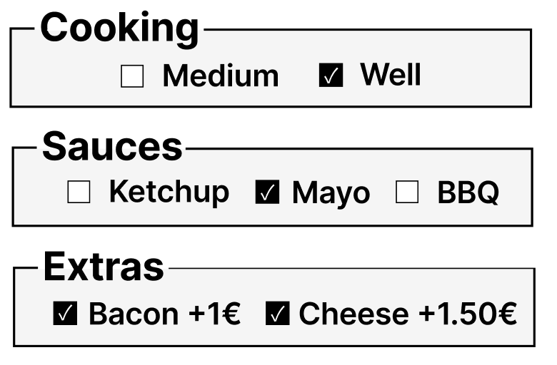

# 🍔 Matt's Diner Component Library

Bibliothèque de composants React pour interface de kiosque de restauration rapide.


---

## Le projet

Reproduction pixel-perfect de mon design Figma vers Storybook pour une borne de commande tactile type McDonald's/KFC.

⚠️ **Interface Kiosque (1080×1920)** 

Ce projet simule une borne de commande de restaurant. 

**Meilleur affichage : Desktop ou tablette en mode portrait.**

Non optimisé pour téléphone

---

## Liens

- **Storybook live :** [Netlify](https://component-library-mattsdinner.netlify.app/)
- **Code source :** [GitHub](https://github.com/Kamat99302/Matt-s-Dinner-Component-Library)

---

## Stack technique

React 19 • Storybook 10 • Vite • CSS

---

## Composants (9)

- **Badge** - Indicateurs de statut (Nouveau, Populaire)
- **Button** - Boutons d'action
- **CartItemCard** - Article dans le panier
- **CategoryTab** - Navigation par catégorie
- **Checkbox** - Personnalisation (burger/drink/fries)
- **Header** - En-tête de page
- **LanguageSelector** - Changement de langue
- **ProductCard** - Affichage produit
- **QuantitySelector** - Ajustement quantité

---

## 📸 Figma → Storybook

| Figma | Storybook |
|-------|-----------|
|  |  |
|  |  |

---

## Défis techniques résolus

**1. Conflits CSS entre composants**
- Problème : Classes génériques (`.card-container`) créaient des conflits
- Solution : Nommage scopé par composant (`.cart-item-card`)

**2. Chargement Google Fonts dans Storybook**
- Problème : `@import` CSS instable
- Solution : `.storybook/preview-head.html`

**3. Composants réutilisables**
- Problème : Code hardcodé
- Solution : Props avec variantes (ex: `type="burger"`)

---

## Apprentissages

Premier projet de bibliothèque de composants. Basé sur un design réalisé par mes soins.

J'ai appris :
- Architecture de composants React
- Scoping CSS et conventions de nommage
- Configuration Storybook
- Reproduction fidèle de designs

---

## Démarrage
```bash
npm install
npm run storybook
```

---

**Matt** • [Portfolio](https://portfoliomattreact.netlify.app/) • [LinkedIn](https://www.linkedin.com/in/matthieu-juan-55568337a/)